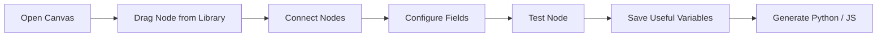
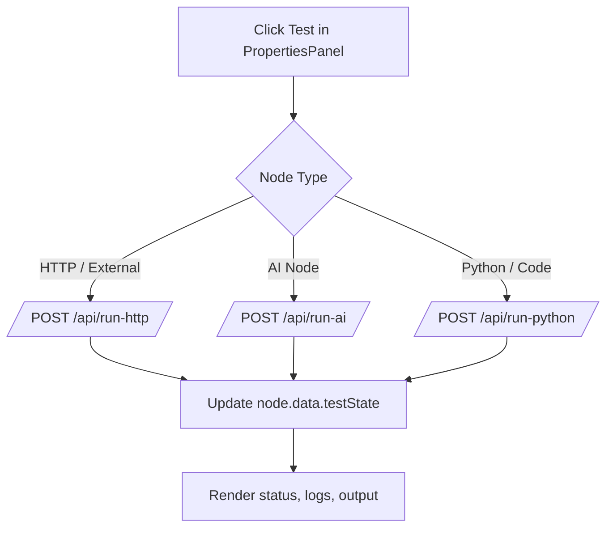
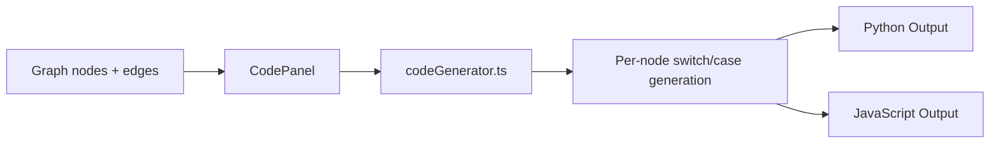

# FlowBuilder

A modern visual workflow automation builder built with **Next.js 16**, **React 19**, and **React Flow**.

Design workflows on a canvas, connect nodes, configure behavior, test execution in-place, and generate production-style **Python** or **JavaScript** code you can own and run anywhere.

---

## Why FlowBuilder

FlowBuilder is built for teams that want:

- Visual speed like Zapier/n8n
- Real generated code (not black-box automation)
- Fast iteration with node-level testing
- Flexible integration with APIs, AI providers, and custom logic

---

## Features

- Drag-and-drop node canvas with live graph editing
- Large built-in node library (trigger, data, flow, AI, external, send, code, end)
- Dynamic branches for switch/case, loops, and try/catch patterns
- Variable system with `{variable_name}` references and saved outputs
- Per-node testing with execution status, logs, output, and errors
- Code generation panel for Python and JavaScript output
- Clean side-panel UX for node configuration and test controls

---

## Tech Stack

- **Framework:** Next.js 16 (App Router)
- **UI:** React 19 + Tailwind CSS 4
- **Canvas/Graph:** `@xyflow/react`
- **Icons:** `lucide-react`
- **Language:** TypeScript (strict)

---

## Project Structure

```text
app/
├── layout.tsx                     # Root layout
├── page.tsx                       # App entry
├── globals.css                    # Global styles
│
├── components/
│   ├── WorkflowCanvas.tsx         # Main orchestrator (state + graph interactions)
│   ├── WorkflowNode.tsx           # Custom node renderer
│   ├── NodeLibrary.tsx            # Left sidebar node palette
│   ├── PropertiesPanel.tsx        # Right sidebar config + test runner
│   ├── VariablePicker.tsx         # Variable insertion UI
│   ├── InteractiveOutputViewer.tsx# Test/output visualization
│   └── CodePanel.tsx              # Generated code view
│
├── lib/
│   ├── types.ts                   # Core types + NODE_LIBRARY definitions
│   ├── codeGenerator.ts           # Python/JS generation logic
│   └── icons.tsx                  # Serializable icon mapping
│
└── api/
    ├── run-http/route.ts          # Server-side HTTP proxy for test runs
    ├── run-ai/route.ts            # AI provider execution endpoint
    └── run-python/route.ts        # Python test execution endpoint
```

---

## Quick Start

### 1) Install dependencies

```bash
pnpm install
```

### 2) Start development server

```bash
pnpm dev
```

Open: [http://localhost:3030](http://localhost:3030)

### 3) Build for production

```bash
pnpm build
pnpm start
```

---

## Scripts

- `pnpm dev` - start local dev server on port `3030`
- `pnpm build` - create production build
- `pnpm start` - run production server on port `3030`
- `pnpm lint` - run ESLint

Type-check command:

```bash
pnpm exec tsc --noEmit
```

---

## Core Architecture

The app keeps workflow state centrally in `WorkflowCanvas`:

- `nodes` -> graph nodes with typed `WorkflowNodeData`
- `edges` -> graph connections and branch wiring
- `selectedNode` -> currently active node in right panel
- `savedVariables` -> extracted values from test outputs
- `showCode` -> toggles canvas/code generation views

The source of truth for node capabilities is `NODE_LIBRARY` in `app/lib/types.ts`.

---

## Product Flows

### 1) Builder Flow (User Journey)



### 2) Node Test Execution Flow



### 3) Code Generation Flow



---

## Data Model

Main node payload type:

- `nodeConfig`: static node definition
- `label`, `description`: display metadata
- `fields`: configured values
- `customFields`: user-added variables/fields
- `testValues`: temporary values for test execution
- `testState`: status, logs, output, errors, timing
- `switchCases`: dynamic branching definitions

---

## Live Test APIs

FlowBuilder includes server routes for safer test execution:

- `POST /api/run-http` - proxies outbound HTTP requests (helps avoid CORS in browser tests)
- `POST /api/run-ai` - calls AI providers (OpenAI/Anthropic/Gemini-style workflows)
- `POST /api/run-python` - executes Python scripts in a subprocess and returns structured output

---

## Adding a New Node Type

1. Add node definition to `NODE_LIBRARY` in `app/lib/types.ts`
2. Ensure icon is mapped in `app/lib/icons.tsx`
3. Add code-generation case in `app/lib/codeGenerator.ts`
4. (Optional) Add node-specific test logic in `app/components/PropertiesPanel.tsx`

After that, the node appears in the palette and can be configured/tested/generated like built-in nodes.

---

## Variable References

Use single-brace syntax in text-like fields:

```text
{customer_name}
{invoice_total}
{timestamp}
```

Variable sources:

- Custom fields from nodes
- Saved output variables from tests
- System-style runtime placeholders

---

## Development Notes

- Keep workflow state in `WorkflowCanvas` (no external state store)
- Keep node definitions centralized in `NODE_LIBRARY`
- Use Tailwind for styling consistency
- Prefer serializable node data for React Flow compatibility
- Run lint + type-check before finalizing changes

---

## Troubleshooting

- **Port already in use**: change the dev port or stop existing process
- **Python tests failing**: ensure `python3` is installed and available in `PATH`
- **Type errors**: run `pnpm exec tsc --noEmit` and resolve before build
- **Node behavior mismatch**: verify `NODE_LIBRARY` field keys align with generator/test logic

---

## Roadmap Ideas

- Workflow save/load persistence
- Multi-workflow project support
- Node templates and versioning
- Team collaboration and execution history
- Deployment targets for generated workflows

---

## License

This project is licensed under the MIT License. See `LICENSE` for details.
